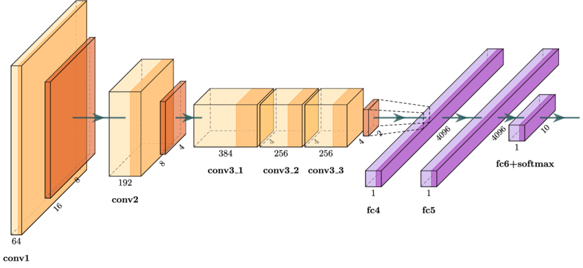

# AlexNet

## Overview

AlexNet is a pioneering convolutional neural network (CNN) architecture that significantly contributed to the field of deep learning. Developed by Alex Krizhevsky, Ilya Sutskever, and Geoffrey Hinton, it won the ImageNet Large Scale Visual Recognition Challenge (ILSVRC) in 2012 by a large margin, demonstrating the power of deep learning for image classification tasks.

AlexNet's architecture is deeper and more complex than previous models, incorporating multiple convolutional layers, pooling layers, and fully connected layers. It also introduced the use of Rectified Linear Unit (ReLU) activations, which helped to mitigate the vanishing gradient problem and allowed for faster training.

## Architecture




AlexNet consists of the following key components:

1. **Convolutional Layers**: These layers extract features from the input image. AlexNet uses five convolutional layers with varying filter sizes and depths.
2. **Activation Function (ReLU)**: The Rectified Linear Unit (ReLU) is used as the activation function to introduce non-linearity and accelerate the training process.
3. **Pooling Layers**: Max-pooling layers are used after some convolutional layers to reduce the spatial dimensions of the feature maps and introduce spatial invariance.
4. **Normalization Layers**: Local Response Normalization (LRN) is used to normalize the activations and help generalization.
5. **Fully Connected Layers**: Three fully connected layers are used at the end of the network to perform classification.
6. **Dropout**: Dropout regularization is applied to the fully connected layers to prevent overfitting.

### Detailed Layer Breakdown

1. **Input Layer**: \(227 \times 227 \times 3\) input image.
2. **Conv Layer 1**: \(96\) filters of size \(11 \times 11\), stride \(4\), followed by ReLU and max-pooling.
3. **Conv Layer 2**: \(256\) filters of size \(5 \times 5\), stride \(1\), followed by ReLU, LRN, and max-pooling.
4. **Conv Layer 3**: \(384\) filters of size \(3 \times 3\), stride \(1\), followed by ReLU.
5. **Conv Layer 4**: \(384\) filters of size \(3 \times 3\), stride \(1\), followed by ReLU.
6. **Conv Layer 5**: \(256\) filters of size \(3 \times 3\), stride \(1\), followed by ReLU and max-pooling.
7. **FC Layer 1**: \(4096\) neurons, followed by ReLU and dropout.
8. **FC Layer 2**: \(4096\) neurons, followed by ReLU and dropout.
9. **Output Layer**: \(1000\) neurons (for classification into 1000 classes).

## Real-World Example

AlexNet's breakthrough was demonstrated by its performance on the ImageNet dataset, which consists of millions of images categorized into 1000 different classes. By winning the ILSVRC 2012, AlexNet showcased the potential of deep learning for image recognition tasks, leading to widespread adoption and further research in the field.

### Practical Application

In practice, AlexNet can be used for various image classification tasks. For example, it can be trained to classify medical images to assist in disease diagnosis, sort images in digital libraries, or even enable autonomous vehicles to recognize objects in their surroundings.

## Python Code (PyTorch)

Here's a simple implementation of AlexNet using PyTorch:

```python
import torch
import torch.nn as nn

class AlexNet(nn.Module):
    def __init__(self, num_classes=1000):
        super(AlexNet, self).__init__()
        self.features = nn.Sequential(
            nn.Conv2d(3, 96, kernel_size=11, stride=4, padding=2),
            nn.ReLU(inplace=True),
            nn.MaxPool2d(kernel_size=3, stride=2),
            nn.Conv2d(96, 256, kernel_size=5, stride=1, padding=2),
            nn.ReLU(inplace=True),
            nn.MaxPool2d(kernel_size=3, stride=2),
            nn.Conv2d(256, 384, kernel_size=3, stride=1, padding=1),
            nn.ReLU(inplace=True),
            nn.Conv2d(384, 384, kernel_size=3, stride=1, padding=1),
            nn.ReLU(inplace=True),
            nn.Conv2d(384, 256, kernel_size=3, stride=1, padding=1),
            nn.ReLU(inplace=True),
            nn.MaxPool2d(kernel_size=3, stride=2),
        )
        self.classifier = nn.Sequential(
            nn.Dropout(),
            nn.Linear(256 * 6 * 6, 4096),
            nn.ReLU(inplace=True),
            nn.Dropout(),
            nn.Linear(4096, 4096),
            nn.ReLU(inplace=True),
            nn.Linear(4096, num_classes),
        )

    def forward(self, x):
        x = self.features(x)
        x = torch.flatten(x, 1)
        x = self.classifier(x)
        return x

# Example usage
model = AlexNet(num_classes=1000)
print(model)
```

In this implementation, the `AlexNet` class defines the network architecture, and the `forward` method specifies how the input data passes through the network layers.

## Conclusion

AlexNet's introduction marked a significant milestone in the history of deep learning, demonstrating the effectiveness of deep convolutional neural networks for image classification. Its architecture, characterized by multiple convolutional and fully connected layers, along with innovations such as ReLU activations and dropout regularization, paved the way for subsequent advances in the field.