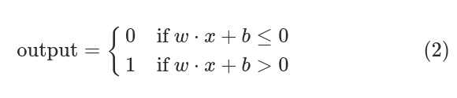
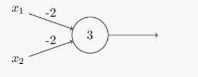
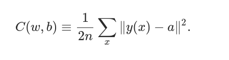
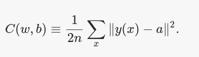
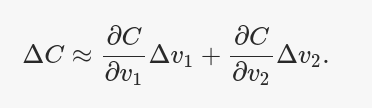
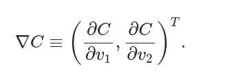
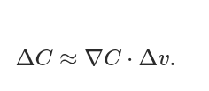
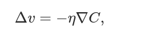
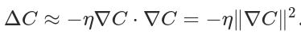
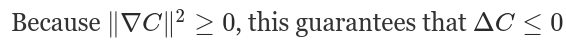

# ch1

http://neuralnetworksanddeeplearning.com/chap1.html

## perceptron

move the threshold to the other side of the inequality, and to replace it by what's known as the perceptron's bias, b≡−threshold

You can think of the bias as a measure of how easy it is to get the perceptron to output a 1. Or to put it in more biological terms, the bias is a measure of how easy it is to get the perceptron to fire. For a perceptron with a really big bias, it's extremely easy for the perceptron to output a 1. But if the bias is very negative, then it's difficult for the perceptron to output a 1.

## perceptron as logic

 input 00 produces output 1, since (−2)∗0+(−2)∗0+3=3 is positive. Here, I've introduced the ∗ symbol to make the multiplications explicit. Similar calculations show that the inputs 01 and 10 produce output 1. But the input 11 produces output 0, since (−2)∗1+(−2)∗1+3=−1 is negative. And so our perceptron implements a NAND gate!

 ## Sigmoid neurons
 Sigmoid neurons are similar to perceptrons, but modified so that small changes in their weights and bias cause only a small change in their output

 If σ had in fact been a step function, then the sigmoid neuron would be a perceptron

 The smoothness of σ means that small changes Δwj in the weights and Δb in the bias will produce a small change Δoutput

 ## quadratic cost function

 

 w denotes the collection of all weights in the network, b all the biases, n is the total number of training inputs, a is the vector of outputs from the network when x is input, and the sum is over all training inputs, x. Of course, the output a depends on x, w and b, but to keep the notation simple I haven't explicitly indicated this dependence. The notation ∥v∥ just denotes the usual length function for a vector v. We'll call C the quadratic cost function; it's also sometimes known as the mean squared error or just MSE. Inspecting the form of the quadratic cost function, we see that C(w,b) is non-negative, since every term in the sum is non-negative. Furthermore, the cost C(w,b) becomes small, i.e., C(w,b)≈0, precisely when y(x) is approximately equal to the output, a, for all training inputs, x. So our training algorithm has done a good job if it can find weights and biases so that C(w,b)≈0. By contrast, it's not doing so well when C(w,b) is large - that would mean that y(x) is not close to the output a for a large number of inputs. So the aim of our training algorithm will be to minimize the cost C(w,b) as a function of the weights and biases. In other words, we want to find a set of weights and biases which make the cost as small as possible.

## gradient descent

### cost function

 w denotes the collection of all weights in the network, b all the biases, n is the total number of training inputs, a is the vector of outputs from the network when x is input, and the sum is over all training inputs, x

replace the w and b notation by v

simplify function of just two variables, which we'll call v1 and v2:

∇C is called the gradient vector

∇C relates changes in v to changes in C

how to choose Δv so as to make ΔC negative

where η is a small, positive parameter - known as the learning rate.

C will always decrease, never increase.

the way the gradient descent algorithm works is to repeatedly compute the gradient ∇C, and then to move in the opposite direction, "falling down" the slope of the valley

### stochastic gradient descent

In practice, to compute the gradient ∇C we need to compute the gradients ∇Cx separately for each training input, x, and then average them - when the number of training inputs is very large this can take a long time

stochastic gradient descent can estimate the gradient ∇C by computing ∇Cx for a small sample of randomly chosen training inputs. By averaging over this small sample it turns out that we can quickly get a good estimate of the true gradient ∇C,

## run

use of class :  Network([2, 3, 1]) 

 initialized randomly to generate Gaussian distributions with mean 0 and standard deviation 1