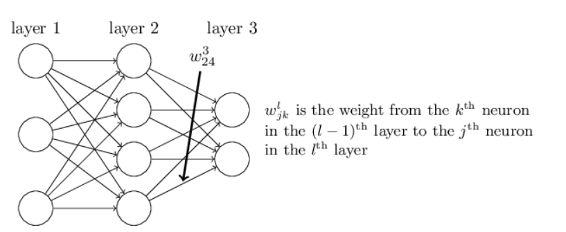
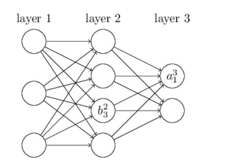
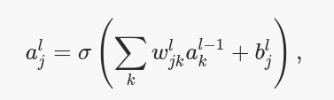
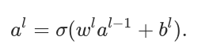
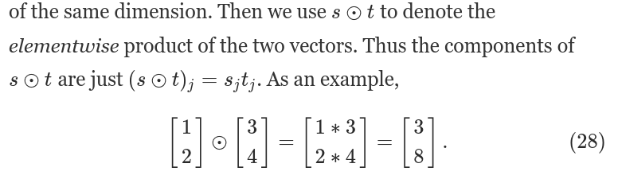

# How the backpropagation algorithm works

* http://neuralnetworksanddeeplearning.com/chap2.html

for example, the diagram below shows the weight on a connection from the fourth neuron in the second layer to the second neuron in the third layer of a network: 

same:

## vectorize

to 

## Hadamard product, s⊙t

